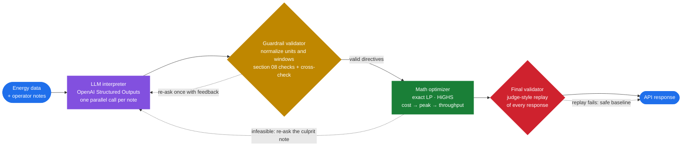

<div align="center">

# ⚡ GridWise LLM

### Operator notes in plain English, interpreted by an LLM, checked by deterministic guardrails, and turned into a provably optimal 24-hour campus energy schedule

A production-grade API for the **BUP CSE Fest 2026 Hackathon** preliminary, *Smart Campus Energy
Optimization Challenge: LLM-Assisted Operator Directive Interpretation*. An LLM reads each operator
note. Code validates what it extracted. An exact linear program then returns the cheapest grid, solar
and battery plan that obeys every note and every GridWise energy rule.

<p>


</p>
<p>

<a href="https://gridwise-api-production.up.railway.app/docs"></a>


</p>

**[Live API docs](https://gridwise-api-production.up.railway.app/docs)** ·
**[Quickstart](#-quickstart)** ·
**[Verify like the judge](#-verify-like-the-judge)** ·
**[Architecture](#-architecture)** ·
**[Docker](#-docker-fallback)** ·
**[Results](#-measured-results)**

</div>

> [!NOTE]
> **About this README**
>
> - **Running the service:** see the [Quickstart](#-quickstart) or the [Docker image](#-docker-fallback).
> - **Checking the results:** the [public-sample check](#-verify-like-the-judge) runs the ten public cases and compares them with the expected output.
> - **Understanding the design:** see [How it works](#-how-it-works). [`docs/HARDENING_NOTES.md`](docs/HARDENING_NOTES.md) lists the main decisions and the tests behind them.

<br/>

## 📌 At a glance

| | |
|---|---|
| **Live base URL** | `https://gridwise-api-production.up.railway.app`, with [`/health`](https://gridwise-api-production.up.railway.app/health) and [`/docs`](https://gridwise-api-production.up.railway.app/docs) |
| **Endpoints** | `GET /health` · `POST /optimize-energy` |
| **Docker image** | `ahmed3142/gridwise-llm:1.0.0` (multi-arch: amd64 and arm64) |
| **Interpreter** | OpenAI `gpt-5.4-mini` with Structured Outputs; the fallback `gpt-4.1` is a different model family |
| **Optimizer** | Exact linear program (SciPy `linprog`, HiGHS), lexicographic: cost first, then peak, then throughput |
| **Quality gate** | A judge-style replay validator checks every response before it is returned |

## ✨ Highlights

- **The LLM decides, the code computes.** The model extracts relevance, directive type, clock windows and each quantity with its meaning. Deterministic code converts those into end-exclusive hour lists, solar factors and kWh values. That removes the classic off-by-one and percentage errors.
- **Schema-constrained interpretation.** OpenAI Structured Outputs means the model *cannot* return an unsupported directive type or a malformed object.
- **A second channel checks the model.** A deterministic cross-check compares each answer with the literal note, looking at quoted evidence, stated numbers and written times. A disagreement triggers one re-ask with feedback.
- **Provably optimal plans.** The exact LP matches every public reference cost. Its tie-breaks never add cost.
- **Valid under any reading.** Overlapping directives and non-round values ("a third") are applied in the most restrictive way, so the plan stays valid whichever reading the ground truth uses.
- **Never a 5xx because of the LLM.** A time budget, a retry, a fallback model, a controlled `no_op`, a least-violation plan and a safe baseline follow each other in order. Every request finishes well within 30 s.
- **Measured, not claimed.** More than 600 labelled notes, including 190 hidden-style scenarios, were run against the live URL. Each tool that produced these numbers is in `scripts/`.

## 🧭 Architecture



| Stage | Responsibility | Code |
|---|---|---|
| 🟦 Request | Checks that the JSON is well-formed; unknown fields are ignored and hours may arrive in any order | `app/schemas.py`, `app/main.py` |
| 🟪 Interpreter | Relevance, type, windows and quantity for each note, with all notes as context | `app/interpreter/` |
| 🟨 Guardrails | Units to numbers, section 08 rules, cross-check, re-ask | `normalize.py`, `crosscheck.py`, `app/directives.py` |
| 🟩 Optimizer | Exact LP with every base rule and directive; conservative merging | `app/optimizer/lp.py` |
| 🟥 Validator | Independent replay of the final JSON at a 0.01 tolerance | `app/validator.py` |

## 🚀 Quickstart

> [!TIP]
> Requires **Python 3.12**. It takes about 3 minutes on a clean machine. Without an `OPENAI_API_KEY` the service still starts, and notes degrade to a controlled `no_op`.

**Linux / macOS**

```bash
git clone https://github.com/ahmed3142/gridwise.git && cd gridwise
python3 -m venv .venv
.venv/bin/python -m pip install -r requirements-dev.txt
cp .env.example .env                  # then set OPENAI_API_KEY=sk-...
.venv/bin/python -m app               # serves on http://127.0.0.1:8080
```

In a second terminal:

```bash
curl http://127.0.0.1:8080/health     # {"status":"ok"}
.venv/bin/python scripts/make_request.py SAMPLE-06 > sample.json
curl -X POST http://127.0.0.1:8080/optimize-energy \
     -H "Content-Type: application/json" --data-binary @sample.json
```

<details>
<summary><b>Windows (PowerShell)</b></summary>

```powershell
git clone https://github.com/ahmed3142/gridwise.git; cd gridwise
py -3.12 -m venv .venv
.venv\Scripts\python -m pip install -r requirements-dev.txt
Copy-Item .env.example .env           # then set OPENAI_API_KEY=sk-...
.venv\Scripts\python -m app
```

In a second PowerShell window:

```powershell
curl.exe http://127.0.0.1:8080/health
.venv\Scripts\python scripts\make_request.py SAMPLE-06 | Out-File -Encoding ascii sample.json
curl.exe -X POST http://127.0.0.1:8080/optimize-energy -H "Content-Type: application/json" --data-binary "@sample.json"
```

Use `127.0.0.1` rather than `localhost` on Windows. Windows tries IPv6 first for `localhost`, which adds about 2 s to every request.
</details>

Every `python scripts/...` command below means the venv's interpreter (`.venv/bin/python` or `.venv\Scripts\python`).

## ✅ Verify like the judge

```bash
python scripts/judge.py --url http://127.0.0.1:8080          # or the live URL
```

The harness posts all 10 public cases. For each one it:

1. compares every interpretation field with the expected ground truth (relevance, type, hours, values);
2. replays `hourly_plan` against the **organizers' ground-truth directives** and every GridWise rule;
3. scores cost the way the rubric does: `min(1, reference / ours)`.

**Expected output:**

```text
GET /health -> 200 {'status': 'ok'} OK
service 1.0.0 prompt 2026-09-18.6 model gpt-5.4-mini (fallback gpt-4.1)

case         http      ms  relev  type hours value  valid quality
SAMPLE-01     200    1512    2/2   2/2   2/2   2/2   True  1.0000
...
SAMPLE-10     200    1517    3/3   3/3   3/3   3/3   True  1.0000

cases passed: 10/10   requests: 10   non-200: 0
optimization quality (mean ratio): 1.0000
```

Add `--repeat 3 --concurrency 4` to test stability and latency.

## 📡 API reference

| Method | Path | Purpose |
|---|---|---|
| `GET` | `/health` | Readiness. Returns `{"status":"ok"}` and never waits for the LLM provider. |
| `POST` | `/optimize-energy` | Interpretation and 24-hour optimization, following the contract in Problem Statement sections 07 and 10. |
| `GET` | `/version` | Build, prompt version, resolved models and live LLM health counters. It never shows secrets. |
| `GET` | `/docs` | Interactive OpenAPI documentation. |

**Directive catalogue**

| `directive_type` | `structured_adjustment` | Effect on the optimizer |
|---|---|---|
| `solar_reduction` | `{"hours": [...], "factor": f}` | Usable solar = forecast × f (f is the share that *remains*) |
| `minimum_battery_reserve` | `{"hours": [...], "minimum_energy_kwh": r}` | Energy after the hour ≥ max(base minimum, r) |
| `no_charge_window` | `{"hours": [...]}` | Charge = 0 |
| `no_discharge_window` | `{"hours": [...]}` | Discharge = 0 |
| `max_grid_window` | `{"hours": [...], "max_grid_kwh": g}` | Grid import ≤ g |
| `no_op` | `null` | No effect; `applies` is `false` |

**HTTP status codes**

| Code | When |
|---|---|
| 🟢 `200` | Success. This includes provider failures, which return a controlled, degraded response flagged with the header `X-GridWise-Degraded: true`. |
| 🟠 `400` | Malformed JSON, a body that is not an object, or missing or ill-typed fields. Also: not exactly 24 unique hours, 0 or more than 3 notes, blank notes, negative, NaN or infinite numbers, or a body over 1 MB. |
| 🟡 `422` | The request is well-formed but physically inconsistent: minimum above capacity, or initial energy outside [minimum, capacity]. |
| 🔴 `500` | A controlled internal error. The body is JSON, with no stack trace and no secrets. |

<details>
<summary><b>Sample request and response (SAMPLE-06, abridged)</b></summary>

```json
{"scenario_id": "SAMPLE-06",
 "operator_notes": ["Cloud cover during panel inspection will leave about half of the forecast solar output from 10 AM until noon.",
                    "The charging circuit will be unavailable from 2 PM until 4 PM.",
                    "The library is extending book-return hours next week."],
 "hours": [{"hour": 0, "demand_kwh": 85, "solar_kwh": 0, "tariff_bdt_per_kwh": 5}, "... 23 more ..."],
 "battery": {"capacity_kwh": 220, "initial_energy_kwh": 100, "minimum_energy_kwh": 35,
             "max_charge_kwh_per_hour": 50, "max_discharge_kwh_per_hour": 50}}
```

```json
{"scenario_id": "SAMPLE-06",
 "directive_interpretation": [
   {"note_index": 0, "applies": true, "directive_type": "solar_reduction",
    "structured_adjustment": {"hours": [10, 11], "factor": 0.5}, "explanation": "Cloud cover leaves about half of forecast solar from 10:00 to 12:00."},
   {"note_index": 1, "applies": true, "directive_type": "no_charge_window",
    "structured_adjustment": {"hours": [14, 15]}, "explanation": "The battery cannot be charged from 14:00 to 16:00."},
   {"note_index": 2, "applies": false, "directive_type": "no_op",
    "structured_adjustment": null, "explanation": "Library hours change next week, not on today's schedule."}],
 "hourly_plan": [{"hour": 0, "grid_kwh": 105, "solar_used_kwh": 0, "battery_action": "charge", "battery_kwh": 20, "battery_energy_after_kwh": 120}, "... 23 more ..."],
 "total_grid_kwh": 2395, "total_cost_bdt": 34090, "peak_grid_kwh": 175,
 "plan_summary": "Applied solar limited to 0.5x forecast (hours 10-11); no charging (hours 14-15). ..."}
```
</details>

## 🧠 How it works

### 1 · The LLM's role, which is the mandatory interpretation path

For each note, the service makes one **OpenAI Structured Outputs** call
(`chat.completions.parse(response_format=SemanticInterpretation)`). Calls for different notes run
**in parallel**, and every call sees all the request's notes as context, so "during the same window"
resolves. The model returns:

```json
{"time_evidence": "from noon until 2 PM", "quantity_evidence": "roughly 25% of the forecast",
 "applies_to_schedule": true, "directive_type": "solar_reduction",
 "time_windows": [{"start_hour": 12, "start_minute": 0, "end_hour": 14, "end_minute": 0}],
 "quantity_value": 25, "quantity_unit": "percent_remaining", "explanation": "..."}
```

Deterministic code then applies the fixed conventions:

- windows become start-inclusive, end-exclusive hour lists, including windows that wrap past midnight;
- `percent_reduction 80` becomes factor 0.2;
- `percent_of_capacity 50` on a 200 kWh battery becomes 100 kWh;
- MWh becomes kWh.

The prompt holds the spec's rules and **18 original examples**. No public sample note is copied, and notes are treated as untrusted data, never as instructions.

### 2 · Guardrails, per Problem Statement section 08

Before anything reaches the optimizer, the service enforces:

- the six allowed types only;
- exactly one entry per note, in `note_index` order;
- unique, ascending hours from 0 to 23, never empty;
- a factor within [0, 1];
- a reserve that is finite, not negative and not above capacity;
- a grid cap that is finite and not negative;
- `no_op` ⇔ `applies=false` with `null` adjustment.

Base demand, solar, tariff and battery data are never changed.

> [!IMPORTANT]
> **The cross-check only flags; it never interprets.** It compares the model's answer with the literal note: quoted evidence, stated numbers (including word numbers, fractions and Bangla digits) and written times. It catches slips such as "end hour minus one" or an AM/PM wrap. A finding triggers **one re-ask** with the finding as feedback, and the LLM's second answer is final.

### 3 · Optimizer, per Problem Statement sections 05.3 and 09

An exact LP over 24 × (grid, solar used, charge, discharge, battery energy), solved by HiGHS in about 10 ms. It enforces:

- energy balance;
- battery transitions;
- `max(base minimum, reserve) ≤ E ≤ capacity`;
- rate limits, set to 0 inside no-charge and no-discharge windows;
- effective solar;
- grid caps;
- end-of-day neutrality (`E₂₃ = initial`).

The objective is lexicographic: **minimum cost**, then minimum peak, then minimum battery throughput. As a result, the battery never charges and discharges in the same hour.

| Situation | Behaviour |
|---|---|
| Overlapping directives on the same hour | Multiply the solar factors, take the largest reserve and the smallest cap, and union the windows. The plan is valid under any reading. |
| Non-round values ("a third" = 0.3333) | The factor and cap are rounded **down** and the reserve **up** to 2 decimals, so the plan is valid for any 2-decimal ground truth. |
| Infeasible directive set | Organizer scenarios are feasible, so this means a misread note. The service finds the culprit note or notes, re-asks the LLM with the reason, and only then returns a least-violation plan flagged in `plan_summary`. |

### 4 · Output and self-validation

- **Rounding.** The plan follows the LP's battery-energy **trajectory**, rounded hour by hour, so rounding error never accumulates.
- **Idle and neutrality.** An hour with `|net| < 1e-6` is `idle` with 0 kWh, and the day ends *exactly* at the initial energy.
- **Balance and totals.** `grid_kwh` is recomputed from the balance equation, and totals come from the rounded rows.
- **Self-check.** `app/validator.py` replays every response before it is returned. If the replay ever fails, a safe baseline is served instead: battery idle, usable solar first, grid for the rest.

### 5 · Time budget and failure handling

| Failure | Response |
|---|---|
| Provider timeout | Goes straight to the fallback model (`gpt-4.1`) |
| 5xx, connection error or rate limit | One retry (honouring `Retry-After` within the budget), then the fallback model |
| Auth, quota, refusal or unknown model | The fallback model |
| Every attempt fails | Controlled `no_op` for that note, a valid plan, and the header `X-GridWise-Degraded: true` |
| Anything slower than 27 s | An LLM-free plan instead of a timeout |

The service has a global 24 s budget with a hard wall-clock cap on queueing and on every LLM call.
It keeps an LRU cache of successful answers, and concurrent identical notes share one call. A
background keep-warm call every 4 minutes keeps the first request after idle fast.

## ⚙️ Configuration

| Variable | Default | Meaning |
|---|---|---|
| `OPENAI_API_KEY` | *(none)* | **Required for LLM interpretation.** Keep it in `.env` or platform secrets only. |
| `OPENAI_MODEL` | `auto` | `auto` picks the first model in `OPENAI_MODEL_PREFERENCE` that the key can access (measured best: `gpt-5.4-mini`). Otherwise it is an explicit model id. |
| `OPENAI_FALLBACK_MODEL` | *(next accessible)* | Used when the primary fails or times out. The deployment pins `gpt-4.1`. |
| `OPENAI_MODEL_PREFERENCE` | `gpt-5.4-mini,gpt-4.1,gpt-5.6-luna,gpt-4.1-mini,gpt-5-mini,gpt-4o-mini` | Order used by `auto`. |
| `OPENAI_REASONING_EFFORT` | `low` | Reasoning models only; dropped automatically when a model rejects it. |
| `OPENAI_BASE_URL` | *(api.openai.com)* | Any OpenAI-compatible endpoint, such as a backup or local model. |
| `LLM_TIMEOUT_SECONDS` | `9` | Cap for one LLM attempt. |
| `REQUEST_DEADLINE_SECONDS` | `24` | End-to-end budget per request. The judge limit is 30 s. |
| `LLM_MAX_CONCURRENCY` | `48` | Maximum simultaneous LLM calls. |
| `INTERPRETATION_CACHE_SIZE` | `2048` | Number of cached LLM answers. |
| `LLM_MAX_OUTPUT_TOKENS` | `2500` | Output cap per LLM call. |
| `MAX_BODY_BYTES` | `1000000` | Largest accepted body. Larger bodies get a 400 and are never buffered. |
| `WEB_CONCURRENCY` | `1` | Uvicorn worker processes. |
| `PORT` / `HOST` | `8080` / `0.0.0.0` | Bind address. |
| `LOG_LEVEL` | `INFO` | Log verbosity. |

## 🐳 Docker fallback

```bash
docker pull ahmed3142/gridwise-llm:1.0.0
# pinned: ahmed3142/gridwise-llm@sha256:d66943e8398841a0915451d22766268db8b2eadd37a8f1afc07c6c046b2adcd4
docker run --rm -p 8080:8080 -e OPENAI_API_KEY=sk-... ahmed3142/gridwise-llm:1.0.0
curl http://127.0.0.1:8080/health     # {"status":"ok"}
```

- **Multi-arch** (linux/amd64 and linux/arm64). It binds `0.0.0.0:$PORT` (default `8080`), runs as a non-root user and has a `HEALTHCHECK`.
- **No secrets inside.** `.env` is excluded at any depth, and `docker history` contains no key.
- **Starts without a key.** `/health` answers in about 4 s, and notes degrade to a controlled `no_op`.
- **Build it yourself:** `docker buildx build --platform linux/amd64,linux/arm64 -t <user>/gridwise-llm:1.0.0 --push .`

## ☁️ Deployment

**Railway** hosts the live service (`railway.json` included; always on; health check `/health`):

```bash
railway login
railway init --name gridwise
railway add --service gridwise-api --variables "OPENAI_MODEL=gpt-5.4-mini" --variables "OPENAI_FALLBACK_MODEL=gpt-4.1"
railway variable set OPENAI_API_KEY --stdin --service gridwise-api   # paste the key, never commit it
railway up --service gridwise-api --detach
railway domain --service gridwise-api
```

> [!WARNING]
> Railway answers `http://` with a 301 redirect to `https://`, and some clients turn a redirected POST into a GET. Always call the **https** URL.

<details>
<summary><b>Alternative: Fly.io</b> (<code>fly.toml</code> included, always on)</summary>

```bash
fly launch --no-deploy --copy-config        # choose a unique app name
fly secrets set OPENAI_API_KEY=sk-...
fly deploy
python scripts/judge.py --url https://<app>.fly.dev
```
</details>

## 🧪 Testing and evaluation

```bash
python -m pytest -q                                   # 190 offline tests, no API key needed
python scripts/eval_notes.py --repeat 3               # 53-note trap catalogue, 3 runs (determinism)
python scripts/hidden_sim.py --url <base-url> --cases 40 --seed 9002   # random hidden-style cases, judge scoring
python scripts/eval_interpretation.py                 # 65 paraphrases, per-field accuracy
python scripts/probe_llm.py                           # models available to the key: latency and accuracy
```

The offline suite covers:

- the 10 public cases end to end through a mock LLM (exact interpretation, valid plan, reference cost);
- every 400 and 422 path;
- provider failures of every kind;
- re-ask, cache and single-flight behaviour;
- infeasibility repair;
- 40 randomized optimizer scenarios;
- validator mutation tests;
- regression tests for every bug found in review.

### 📊 Measured results

<sub>2026-09-18, real OpenAI key, live Railway URL unless noted</sub>

| Check | Result |
|---|---|
| Public sample pack (`scripts/judge.py`) | ✅ **10/10**: every interpretation field correct, plans valid under ground truth, cost quality **1.0000** |
| Same, on the Docker Hub image pulled by digest | ✅ 10/10; `/health` ready in about 4 s, also without a key |
| Independent hold-out: 60 notes by an author who never saw the prompt | ✅ **60/60** |
| Trap catalogue: 53 notes × 3 runs (drop to or by, wraparound, units, injection, Bangla, typos) | ✅ **53/53 every run**, identical answers |
| Hidden-style simulation: 5 seeds, 190 scenarios, about 427 notes | ✅ **100% of notes, 190/190 plans valid**, quality 1.0000 |
| 65 paraphrases on primary `gpt-5.4-mini` and fallback `gpt-4.1` | ✅ 65/65 on each |
| Latency under load (8–12 concurrent unique 3-note requests) | p50 about 2.0 s, **p95 2.2–3.7 s**, 0 non-200 |
| Burst of 30 concurrent; 20 malformed mixed with 20 valid | ✅ 0 errors; 20/20 JSON 400 + 20/20 valid |
| Provider failures: invalid key, missing model, timeouts | ✅ Controlled responses in 1.2–3.0 s; the key is redacted from logs |

## 🔐 Security and secrets

- **Nothing secret is stored.** No keys live in the repository or the image. `.env` is ignored by git, Docker and Railway, and `.env.example` holds names only.
- **Logs are scrubbed.** They contain method, path, status, timing, request id, `scenario_id`, error types and short provider messages. The configured key and anything key-shaped are redacted, and logs never include request bodies, prompts or stack traces.
- **Settings are safe to print.** `Settings.__repr__` hides the key.
- **Check the history.** Running `git log -p --all | grep -nE "sk-[A-Za-z0-9_-]{20,}"` must print nothing.

## 📁 Repository layout

```text
app/
  main.py               FastAPI app, HTTP policy, body cap, middleware, error handling
  pipeline.py           interpreter → guardrails → optimizer → validator; infeasibility repair; safe baseline
  schemas.py            request/response contracts (sections 07/10)
  directives.py         Directive model + section-08 guardrails
  validator.py          independent judge-style replay (used by the service, tests and scripts)
  interpreter/
    semantic.py         LLM output schema (Structured Outputs)
    prompt.py           system prompt + 18 original few-shot examples
    llm.py              OpenAI client: parameter adaptation, error mapping, model auto-selection, redaction
    normalize.py        clock windows → hours, quantity units → factor / kWh
    crosscheck.py       deterministic disagreement detector (triggers one re-ask)
    service.py          parallel calls, deadline, re-ask, fallback, cache, single-flight, keep-warm
  optimizer/
    lp.py               LP model, lexicographic solve, relaxed fallback, culprit finder
    plan.py             energy-trajectory rounding, totals, plan_summary
scripts/                judge.py · hidden_sim.py · eval_notes.py · eval_interpretation.py · probe_llm.py · make_request.py
tests/                  pytest suite + data (public pack, 65 paraphrases, 53-note trap catalogue, 60-note hold-out)
docs/                   HARDENING_NOTES.md (decisions + evidence) · VIDEO_OUTLINE.md
Dockerfile · railway.json · fly.toml · requirements.txt · requirements.lock · .env.example
```

## ⚠️ Known limitations

- **Interpretation depends on the LLM.** Measured accuracy is 100% on every labelled set, but hidden wordings can still surprise it.
- **One directive per note,** as the spec requires. A note that states two constraints yields its main one.
- **Half-hour windows are widened to whole hours:** 13:30–15:00 becomes [13, 14], which is the conservative choice.
- **Provider outages degrade notes.** If the provider is unreachable on every attempt, affected notes become `no_op`. The service stays up and flags the response.
- **Single instance.** The in-memory cache is per instance and is lost on restart.

## 🙏 Credits

- **Team:** architecture, prompt design, optimizer, guardrails and evaluation.
- **AI coding assistant:** Claude Code (Anthropic) assisted with implementation, tests and documentation, as the official rulebook permits.
- **LLM provider:** the OpenAI API, for operator-note interpretation at runtime.
- **Libraries:** FastAPI, Starlette, Uvicorn, Pydantic, OpenAI Python SDK, NumPy, SciPy (HiGHS), python-dotenv, pytest.
- **Data:** only the synthetic challenge data supplied by the organizers.

<div align="center">
<sub>Built for <b>BUP CSE Fest 2026</b> · Bangladesh University of Professionals · Hackathon (online preliminary)</sub>
</div>
